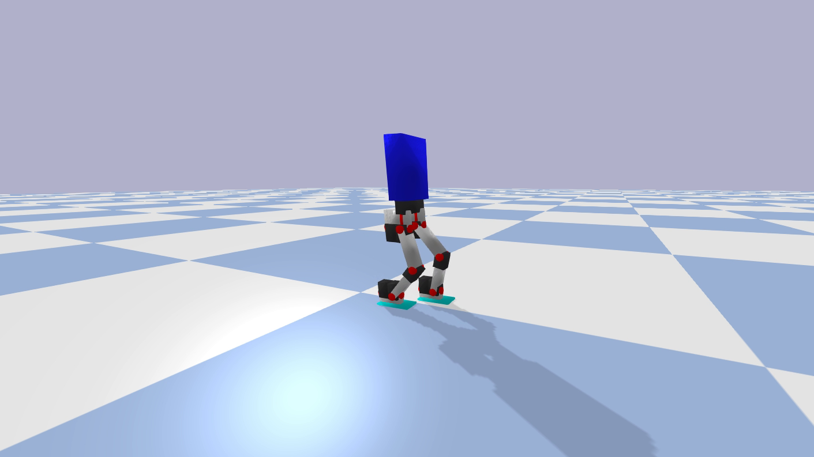
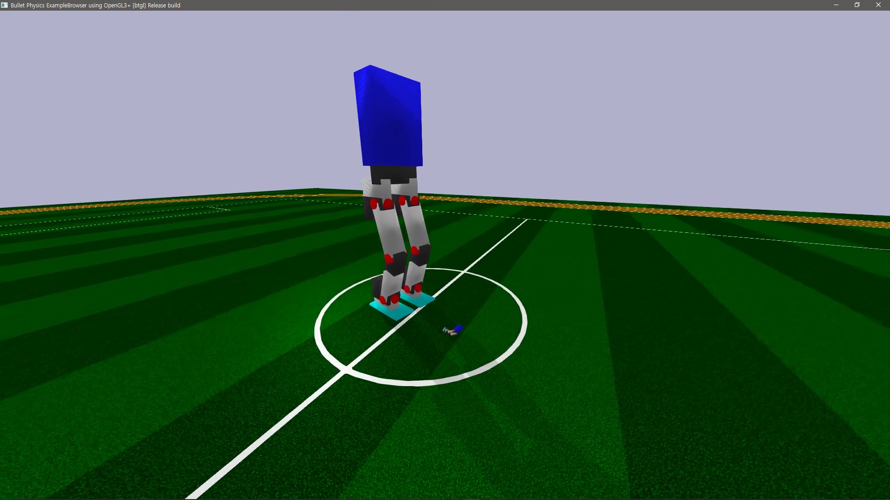
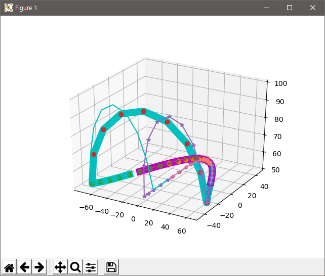

## Overview

This is the code for [this](https://youtu.be/lXZ6y3lMymM) video on Youtube by Siraj Raval on the Boston Dynamics Atlas Robot. It's a bipedal robot walking simulation using the [pybullet](https://pypi.org/project/pybullet/) library. 

## walking_simulation_example.py

An example of simulation of robot walking.

## play_various_walking.py

Youtube video: <https://youtu.be/5MpcD8YFSbI>

## walkGenerator.py

This generates gait points. Has inverse kinematics function.

## motorController.py

Helps to control motors. Time-based control.

## Credits

Credits for this code go to [einsbon](https://github.com/Einsbon/). I've merely created a wrapper to get people started. 
